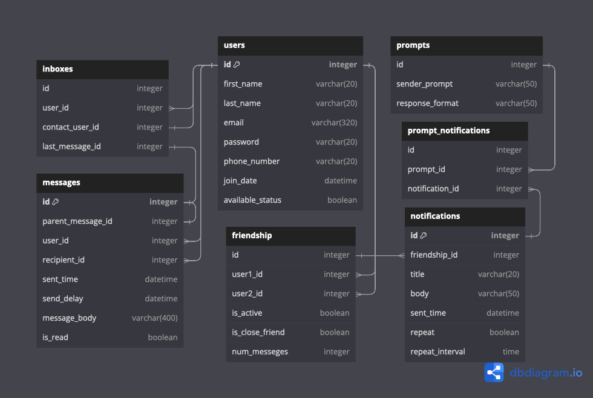
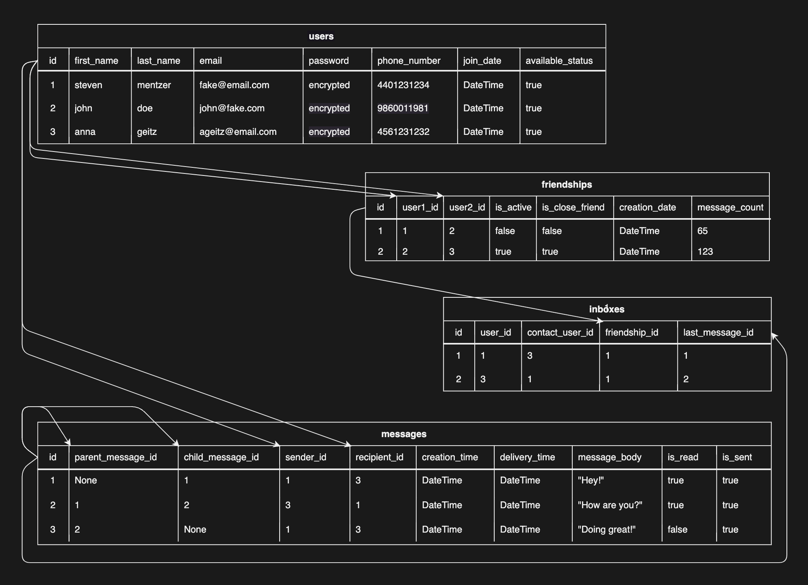

# Here IM 'Instant Messenger'
<sup> Creator: Steven Mentzer </sup>

### Where connections thrive, profiles shine, and friendships are rekindled with every prompt.

The HereIM app provides users with the ability to log on and connect with friends. With features for account management, friend connections, and notification preferences, HereIM offers a comprehensive platform for social interaction and communication. HereIM prompts users to reach out to people they may not have talked to in a while, fostering reconnections and strengthening relationships within the community. Through personalized reminders and suggestions, HereIM encourages users to stay connected and engaged with their network, promoting a sense of community and support.

### Technologies Used
<sup> 
<b>Python</b>: The primary language used for backend development.
<b>Flask</b>: A micro web framework written in Python.
<b>Flask-Bcrypt</b>: A data encryption package used to hide password values.
<b>React</b>: A JavaScript library for building user interfaces.
<b>REST APIs</b>: Handles requests and responses between the client and server.
<b>SQLAlchemy</b>: An SQL toolkit and Object-Relational Mapping (ORM) for Python.
<b>Dbdiagram.io</b>: An ORD visualization software
</sup>

### Primary Messenger Features


Upon signing in, the user is welcomed to the page and presented with prompts suggesting individuals they may benefit from reaching out to. These prompts are generated based on factors such as the number of shared messages, the recency of the last interaction, and upcoming birthdays. The user can seamlessly transition into the built-in messenger, which offers a familiar and distinctive interface.

### Unique 'Delay Send' Feature


When you wish to send a message at a more convenient time, ensure timely congratulations, or simply reach out without committing to a full conversation, users can schedule their messages accordingly. 

The system offers five preset time intervals for delayed sending upon click, along with a random button that selects a time within the next 24 hours. Additionally, users can utilize an input slider to choose a specific time in 5-minute intervals.

### Secondary Features


Users can access a list of friends, add new ones, remove existing connections, and toggle a "close friend" status for enhanced organization and prioritization. Account information can be edited and the account can be fully shut down.


## Backend (API)
### Model Relationships
#### One to One - Message to Message
* A `Message` will have a `Message` as a child/parent relationship

#### One to Many - User to Messages, and Inboxes
* A `User` has many `Messages` and `Inboxes`
* A `Message` belongs to one `User`
* A `Inbox` belongs to one `User` and one `Message`... `last_message_id` is set to the most child `Message`

#### One to Many - Friendships to Notifications
* A `Friendship` relationship has many `Notifications`
* A `Notification` has one `Friendship` relationship

#### Many to One - PromptNotifications to Prompts and Notifications
* A `PromptNotification` relationship links one `Prompt` and one `Notifications`
* A `Notification` has one `PromptNotification` relationship
* A `Prompt` has one `PromptNotification` relationship

#### Many to Many - Users through Friendships
* `Friendship`s are bi-directional, where many `Users` can have a `Friend` relationship with many other `Users`

### Model Validations

#### Users
* `first_name` and `last_name` must be Strings under 20 characters
* `username` must be 7-20 characters and not already exist
* `password` must be 7-20 characters`

#### Friendships
* `user1_id` and `user2_id` must exist
* `is_active` and `is_close_friend` are both initialized to false
* `creation_date` is set to time of initialization
* `message_count` is initialized at 0

#### Messages
* `parent_message_id` must exist and must be less than self.id
* `sender_id` and `recipient_id` must exist
* `sent_time` is set upon initialization
* `delivery_time` is optional and must be type DateTime
* `message_body` must be less than 400 characters
* `is_read` is initialized to false

#### Inboxes
* `user_id`, `contact_user_id`, and `last_message_id` must exist

## Controllers

### API Routes - RESTful Conventions

#### Users
- POST/users
- GET/users
- GET/user/<int:id>
- PATCH/user/<int:id>
- DELETE/user/<int:id>

#### Friendships
- POST/friends
- GET/user/<int:id>/friends
- PATCH/user/<int:id>/friend<int:id>
- DELETE/user/<int:id>/friend<int:id>

#### Messages
- POST/messages
- GET/user<int:id>/messages
- PATCH/message/<int:id>
- DELETE/message/<int:id>

#### Inboxes
- GET/user/<int:id>/inboxes
- DELETE/inbox/<int:id>


### React Routes
```
Landing  --- (/)
Login  --- (/login)
Home  --- (/home)
Messenger  --- (/messenger)
Friends  --- (/friends)
```

## Data Flow Visualizations

 ### ERD Database Table: 
 The entity relationship database is illustrated here: 



 ### ORD Database Table: 
 The object relationship diagram is illustrated here: 



 ### Front End Wireframe:  

https://www.figma.com/file/VS2cu5JyvLj5hw440Iv1Yz/Final-Project?type=whiteboard&node-id=0%3A1&t=EZPzWHMwZd3h14gG-1


## Installation Instructions

1. Fork and clone Git repository
2. Navigate to base directory in your terminal and run the following code: 

    ```pipenv install && pipenv shell```
    
3. Navigate to `server` directory in your terminal and run the following code: 

    ```python seed.py [number of desired fake users; default 25]```

    ```export FLASK_APP=app.py```
    
    ```export FLASK_RUN_PORT=5555```

    ```flask run```

4. Navigate to `client` directory in a second terminal and run the following code: 

    ```npm start```

5. Enjoy the program!


## Licenses

MIT License

Copyright (c) 2024, Steven Mentzer

Permission is hereby granted, free of charge, to any person obtaining a copy
of this software and associated documentation files (the "Software"), to deal
in the Software without restriction, including without limitation the rights
to use, copy, modify, merge, publish, distribute, sublicense, and/or sell
copies of the Software, and to permit persons to whom the Software is
furnished to do so, subject to the following conditions:

The above copyright notice and this permission notice shall be included in all
copies or substantial portions of the Software.

THE SOFTWARE IS PROVIDED "AS IS", WITHOUT WARRANTY OF ANY KIND, EXPRESS OR
IMPLIED, INCLUDING BUT NOT LIMITED TO THE WARRANTIES OF MERCHANTABILITY,
FITNESS FOR A PARTICULAR PURPOSE AND NONINFRINGEMENT. IN NO EVENT SHALL THE
AUTHORS OR COPYRIGHT HOLDERS BE LIABLE FOR ANY CLAIM, DAMAGES OR OTHER
LIABILITY, WHETHER IN AN ACTION OF CONTRACT, TORT OR OTHERWISE, ARISING FROM,
OUT OF OR IN CONNECTION WITH THE SOFTWARE OR THE USE OR OTHER DEALINGS IN THE
SOFTWARE.