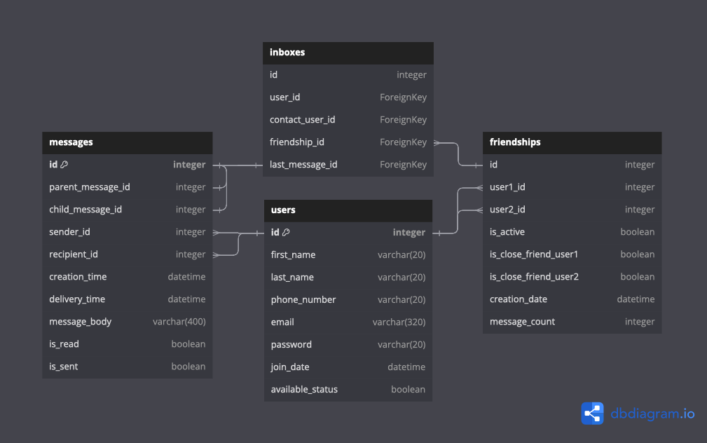

# Here IM 'Instant Messenger'
<sup> Creator: Steven Mentzer </sup>

### Where connections thrive, profiles shine, and friendships are rekindled with every prompt.

The HereIM app provides users with the ability to log on and connect with friends. With features for account management, friend connections, and notification preferences, HereIM offers a comprehensive platform for social interaction and communication. HereIM prompts users to reach out to people they may not have talked to in a while, fostering reconnections and strengthening relationships within the community. Through personalized reminders and suggestions, HereIM encourages users to stay connected and engaged with their network, promoting a sense of community and support.


## Installation Instructions

1. Fork and clone Git repository
2. Navigate to base directory in your terminal and run the following code: 

    ```pipenv install && pipenv shell```
    
3. Navigate to `server` directory in your terminal and run the following code: 

    ```python seed.py```

    ```export FLASK_APP=app.py```
    
    ```export FLASK_RUN_PORT=5555```

4. Navigate to `client` directory in your terminal and run the following code: 

    ```npm start```

5. Enjoy the program!

## Project Goals
### MVP
- [ ] Users can login and add friends and set them as 'close friends'
- [ ] Instant Messaging works
- [ ] Users can view a friends-list
- [ ] Users can indicate if they want to be contacted with Status

### Stretch Goals
- [ ] Users are notified to send messages to random friends with prompts
- [ ] Allows a user to send a delayed text message
- [ ] If messages are drafted and not sent, A notification syaing ‘someone was thinking of you’ is sent
- [ ] Edit a sent message


## Backend (API)
### Model Relationships
#### One to One - Message to Message
* A `Message` will have a `Message` as a child/parent relationship

#### One to Many - User to Messages, and Inboxes
* A `User` has many `Messages` and `Inboxes`
* A `Message` belongs to one `User`
* A `Inbox` belongs to one `User` and one `Message`... `last_message_id` is set to the most child `Message`

#### One to Many - Friendships to Notifications
* A `Friendship` relationship has many `Notifications`
* A `Notification` has one `Friendship` relationship

#### Many to One - PromptNotifications to Prompts and Notifications
* A `PromptNotification` relationship links one `Prompt` and one `Notifications`
* A `Notification` has one `PromptNotification` relationship
* A `Prompt` has one `PromptNotification` relationship

#### Many to Many - Users through Friendships
* `Friendship`s are bi-directional, where many `Users` can have a `Friend` relationship with many other `Users`

### Model Validations

#### Users
* `first_name` and `last_name` must be Strings under 20 characters
* `username` must be 7-20 characters and not already exist
* `password` must be 7-20 characters`

#### Friendships

#### Messages

#### Prompts

#### Notifications


## Controllers
### API routes RESTful conventions
#### Users
```
POST/users
```
```
GET/user-<int:id>
PATCH/user-<int:id>
DELETE/user-<int:id>
```
#### Friendships
```
GET/user-<int:id>/friends
POST/user-<int:id>/friends
```
```
PATCH/user-<int:id>/friend<int:id>
DELETE/user-<int:id>/friend<int:id>
```
#### Messages
```
POST/messages
```
```
GET/message/<int:id>
PATCH/message/<int:id>
DELETE/message/<int:id>
```
```
GET/user<int:id>/messages
```
#### Inboxes
```
GET/user-<int:id>/inbox
POST/user-<int:id>/inbox
```
```
PATCH/user-<int:user_id>/inbox<int:inbox_id>
DELETE/user-<int:user_id>/inbox<int:inbox_id>
```
#### Notifications
```
GET/user-<int:id>/notifications
POST/user-<int:id>/notifications
```
```
DELETE/user-<int:id>/notifications/<int:id>
```


### React Routes
```
Landing  --- (/)
Login  --- (/login)
Home  --- (/home)
Messenger  --- (/messenger)
Friends  --- (/friends)
```
## Data Flow Visualizations

 ### ERD Database Table: 
 The entity relationship database is illustrated here: 

 https://dbdiagram.io/d/65d528fdac844320ae9d8903


 ### ORD Database Table: 
 The entity relationship database is illustrated here: 


 ### Front End Wireframe:  

https://www.figma.com/file/VS2cu5JyvLj5hw440Iv1Yz/Final-Project?type=whiteboard&node-id=0%3A1&t=EZPzWHMwZd3h14gG-1

## Technologies Used

- **Python**: The primary language used for backend development.
- **Flask**: A micro web framework written in Python.
- **Flask-Bcrypt**: A data encryption package used to hide password values.
- **React**: A JavaScript library for building user interfaces.
- **REST APIs**: Handles requests and responses between the client and server.
- **SQLAlchemy**: An SQL toolkit and Object-Relational Mapping (ORM) for Python.
- **Dbdiagram.io**: An ORD visualization software
